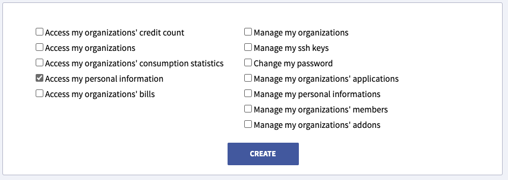

# Clever-cloud Identity Provider

*By please-open.it*

## Create an oauth consumer

### Using Web Console

Go to "+ Create..." then choose "an oAuth consumer"


Then, add your informations about your Keycloak server : 


You can give only "Access my personal information"



Afterthat, you have a key and a secret, you are done.

## Install in Keycloak

Just do 

```
mvn clean install
```

Copy the generated JAR from "deployment" to "providers" directory in Keycloak. Restart Keycloak. You are done.

